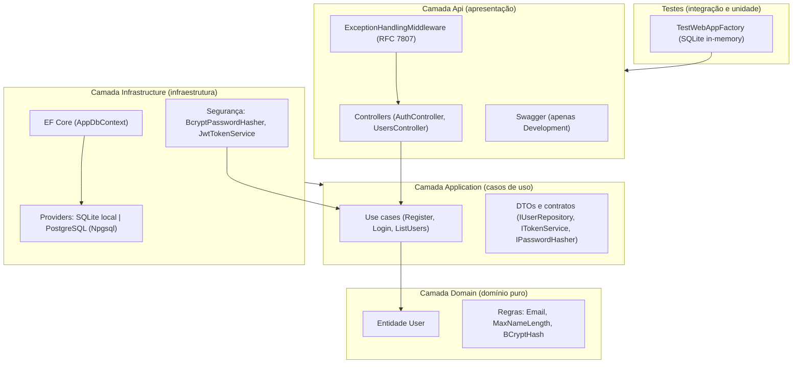
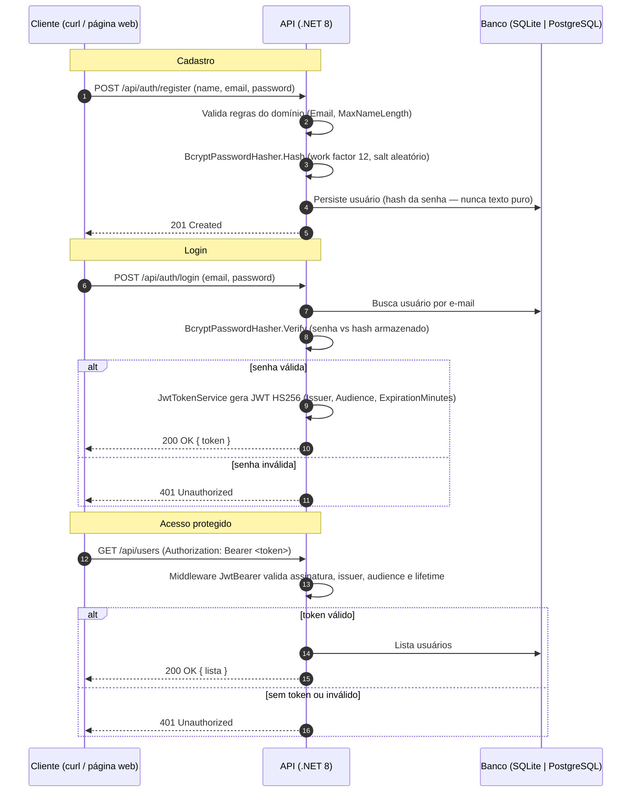
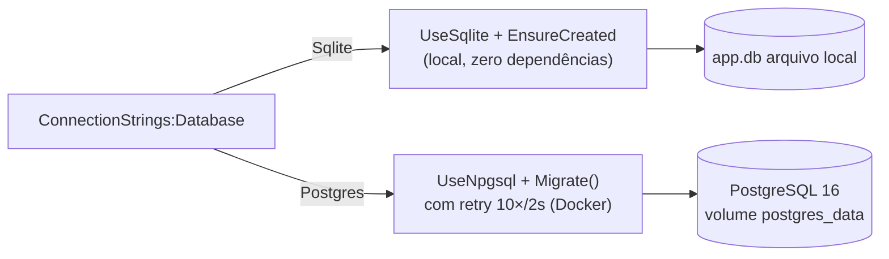
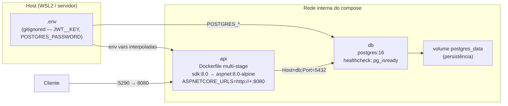

# dotnet-user-management-api — Arquitetura

API de gerenciamento de usuários em **.NET 8** seguindo **Clean Architecture**, com cadastro, autenticação via **JWT + BCrypt** e listagem de usuários em endpoint protegido. Este documento descreve a arquitetura em camadas, o fluxo de autenticação e o deploy containerizado (Docker Compose + PostgreSQL 16), com as justificativas das tecnologias e padrões escolhidos em cada nível.

## Arquitetura em camadas

A aplicação segue a **Clean Architecture** em 4 camadas, com a dependência apontando sempre para dentro: a `Api` depende da `Application`, que depende da `Domain`; a `Infrastructure` implementa os contratos definidos pela `Application` e é referenciada pela `Api` (composition root). Os testes exercitam a aplicação de ponta a ponta pela `Api`.



### Justificativas por camada

| Camada | Tecnologia / padrão | Justificativa |
|--------|---------------------|---------------|
| **Api** | ASP.NET Core controllers + middleware `ExceptionHandlingMiddleware` | Separa a apresentação (HTTP) das regras de negócio. O middleware global de exceção padroniza erros no formato RFC 7807 (Problem Details), evitando vazamento de detalhes internos e garantindo respostas consistentes para o cliente. Swagger exposto apenas em `Development` (não vaza contrato em produção). |
| **Application** | Use cases + DTOs + contratos (`IUserRepository`, `ITokenService`, `IPasswordHasher`) | Orquestra casos de uso sem conhecer a infraestrutura: depende apenas de abstrações, o que torna os casos de uso testáveis isoladamente e permite trocar o banco ou o provedor de token sem alterar regras de negócio. |
| **Domain** | Entidade `User` com regras (`Email`, `MaxNameLength`) | Domínio puro sem dependências de framework. As invariantes de negócio (formato de e-mail, tamanho máximo de nome) vivem junto da entidade, garantindo que nenhum estado inválido seja persistido. |
| **Infrastructure** | EF Core (SQLite/PostgreSQL), BCrypt (work factor 12), JWT HS256 | Implementa os contratos da Application. O EF Core abstrai o mapeamento objeto-relacional nos dois providers; o BCrypt com work factor 12 provê hash de senha com salt aleatório resistente a brute force; o `JwtTokenService` emite e valida tokens stateless. |

## Fluxo de autenticação

A autenticação é **stateless** (JWT HS256): o servidor não mantém sessão — o token assinado carrega a identidade do usuário e é validado em cada requisição protegida pelo middleware `JwtBearer`.



### Justificativas

- **JWT HS256 stateless**: a API não armazena sessão, o que simplifica o deploy (qualquer instância valida o token com a mesma chave) e elimina o custo de lookup em banco a cada requisição. HS256 (HMAC com chave simétrica) é suficiente para um serviço único que assina e valida seus próprios tokens.
- **BCrypt com salt**: cada hash embute um salt aleatório, impedindo ataques de tabela rainbow e tornando a comparação propositalmente custosa (work factor 12) contra brute force.
- **Chave nunca versionada**: a chave de assinatura é fornecida via variável de ambiente `JWT__KEY` em produção (fail-fast se ausente) e gerada aleatoriamente apenas em desenvolvimento — nenhuma chave real existe no repositório.

## Persistência dual-provider

A seleção do banco é dirigida por uma **chave de configuração explícita**, `ConnectionStrings:Database`, com dois valores possíveis:

- **`Sqlite`** (default): banco local, zero dependências, criado no startup com `EnsureCreated()` — ideal para desenvolvimento e para o fluxo rápido "rodar com um comando".
- **`Postgres`**: banco prod-like via Docker, com **migrações EF Core aplicadas no startup** com retry limitado (10 tentativas a cada 2s capturando `NpgsqlException`) — tolera a corrida de readiness do compose apesar do healthcheck.

A mesma chave dirige o registro do `DbContext` (`UseSqlite` vs `UseNpgsql`) e o init de banco no startup — um único ponto de decisão, sem detecção automática de prefixo de connection string.



| Aspecto | SQLite (local) | PostgreSQL (Docker) |
|---------|----------------|---------------------|
| Uso | Desenvolvimento / testes | Produção-like / desafio |
| Criação do schema | `EnsureCreated()` no startup | Migrações EF Core (`Migrate()`) no startup |
| Dependência externa | Nenhuma | Container `postgres:16` |
| Persistência | Arquivo `app.db` | Volume nomeado `postgres_data` |
| Seleção | `ConnectionStrings:Database=Sqlite` | `ConnectionStrings:Database=Postgres` |

## Deploy com Docker Compose

O compose sobe dois serviços prod-like: a API (imagem multi-stage própria) e o PostgreSQL 16, com volume nomeado para persistência, healthcheck de readiness e `depends_on: service_healthy` para a API aguardar o banco.



### Variáveis de ambiente

| Variável | Serviço | Descrição |
|----------|---------|-----------|
| `ASPNETCORE_ENVIRONMENT` | api | `Production` (Swagger desligado, `JWT__KEY` obrigatória) |
| `ASPNETCORE_URLS` | api | `http://+:8080` (porta interna do container) |
| `ConnectionStrings__Database` | api | `Postgres` — seleciona o provider Npgsql |
| `ConnectionStrings__Default` | api | Connection string do PostgreSQL (host `db`, porta 5432) |
| `Jwt__Key` | api | Interpolada de `JWT__KEY` do `.env` com fail-fast `${JWT__KEY:?}` |
| `POSTGRES_USER` / `POSTGRES_PASSWORD` / `POSTGRES_DB` | db | Credenciais do banco, interpoladas do `.env` |

> O arquivo **`.env.example` é versionado apenas com placeholders**; o `.env` real (com segredos) é gitignored e nunca entra no repositório nem no build context do Docker (`.dockerignore`).

## Segurança

- **`JWT__KEY` obrigatória em produção**: o startup lança `InvalidOperationException` se a chave estiver ausente fora de `Development` (fail-fast), e o compose também aborta com `${JWT__KEY:?}` — impossível subir o ambiente prod-like sem a chave.
- **Senhas com BCrypt** (work factor 12): nunca armazenadas em texto puro; a comparação é feita por `Verify` sobre o hash.
- **Segredos só no `.env` gitignored**: nomes de variáveis documentados, valores reais nunca versionados nem citados em documentação.
- **PostgreSQL sem porta exposta ao host**: o `db` fica apenas na rede interna do compose — a única porta publicada é `5290:8080` da API.

## CI/CD

O pipeline de CI (``.github/workflows/ci-cd.yml`) roda **build + testes apenas**, sem etapas de análise estática (decisão D-10) e sem passos de deploy ou uso de secrets — gatilhos: push para `main` e pull requests. Os testes usam SQLite in-memory via `TestWebAppFactory`, portanto o runner Linux (`ubuntu-latest`) é suficiente. Exemplo conceitual do pipeline:

```yaml
name: CI
on:
  push:
    branches: [main]
  pull_request:
jobs:
  build-test:
    runs-on: ubuntu-latest
    steps:
      - uses: actions/checkout@v4
      - uses: actions/setup-dotnet@v4
        with: { dotnet-version: '8.0.x' }
      - run: dotnet restore solution/DotnetUserManagementApi.sln
      - run: dotnet build solution/DotnetUserManagementApi.sln -c Release --no-restore
      - run: dotnet test solution/DotnetUserManagementApi.sln -c Release --no-build
```

## Decisões técnicas

| Decisão | Por quê |
|---------|---------|
| Clean Architecture (4 camadas) | Separação clara de responsabilidades, testável e auditável |
| JWT (HS256) stateless | API sem sessão; token assinado carrega a identidade do usuário |
| BCrypt (work factor 12) | Hash com salt aleatório, resistente a brute force |
| EF Core dual-provider (SQLite/PostgreSQL) | Zero configuração local + Postgres prod-like via `ConnectionStrings:Database` |
| Docker multi-stage + compose prod-like | Imagem leve (`aspnet:8.0-alpine`) e ambiente reproduzível com PostgreSQL 16 |
| `InvariantGlobalization=true` | Execução garantida em ambientes sem libicu (WSL2 minimalista) e imagem runtime sem dependência extra |

## Critérios de entrega (desafio)

| Critério (verbatim) | Onde neste documento |
|---------------------|----------------------|
| "Diagramas (Mermaid.js…) da arquitetura e do fluxo de autenticação" | Diagramas Mermaid em **Arquitetura em camadas**, **Fluxo de autenticação** e **Deploy com Docker Compose** |
| "Justificativas claras para as tecnologias e padrões escolhidos em cada nível" | Tabelas de justificativas por camada, por fluxo de autenticação e de persistência dual-provider |
| "Exemplos conceituais de trechos críticos de código ou scripts… apenas se julgar necessário" | Exemplo conceitual do pipeline CI na seção **CI/CD** (sem valores reais de segredo) |